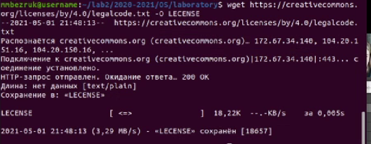

---
# Front matter
lang: ru-RU
title: "Отчет по лабораторной работе №3"
subtitle: "Операционные системы"
author: "Безрук Мария Андреевна"

# Formatting
toc-title: "Содержание"
toc: true # Table of contents
toc_depth: 2
lof: true # List of figures
lot: true # List of tables
fontsize: 12pt
linestretch: 1.5
papersize: a4paper
documentclass: scrreprt
polyglossia-lang: russian
polyglossia-otherlangs: english
mainfont: PT Serif
romanfont: PT Serif
sansfont: PT Sans
monofont: PT Mono
mainfontoptions: Ligatures=TeX
romanfontoptions: Ligatures=TeX
sansfontoptions: Ligatures=TeX,Scale=MatchLowercase
monofontoptions: Scale=MatchLowercase
indent: true
pdf-engine: lualatex
header-includes:
  - \linepenalty=10 # the penalty added to the badness of each line within a paragraph (no associated penalty node) Increasing the value makes tex try to have fewer lines in the paragraph.
  - \interlinepenalty=0 # value of the penalty (node) added after each line of a paragraph.
  - \hyphenpenalty=50 # the penalty for line breaking at an automatically inserted hyphen
  - \exhyphenpenalty=50 # the penalty for line breaking at an explicit hyphen
  - \binoppenalty=700 # the penalty for breaking a line at a binary operator
  - \relpenalty=500 # the penalty for breaking a line at a relation
  - \clubpenalty=150 # extra penalty for breaking after first line of a paragraph
  - \widowpenalty=150 # extra penalty for breaking before last line of a paragraph
  - \displaywidowpenalty=50 # extra penalty for breaking before last line before a display math
  - \brokenpenalty=100 # extra penalty for page breaking after a hyphenated line
  - \predisplaypenalty=10000 # penalty for breaking before a display
  - \postdisplaypenalty=0 # penalty for breaking after a display
  - \floatingpenalty = 20000 # penalty for splitting an insertion (can only be split footnote in standard LaTeX)
  - \raggedbottom # or \flushbottom
  - \usepackage{float} # keep figures where there are in the text
  - \floatplacement{figure}{H} # keep figures where there are in the text
---

# Цель работы

Изучить идеологию и применение средств контроля версий.

# Задание

–Сделайте отчёт по предыдущей лабораторной работе в формате Markdown.
–В качестве отчёта просьба предоставить отчёты в 3 форматах:pdf,docxиmd(вархиве,поскольку он должен содержать скриншоты,Makefile ит.д.)

# Выполнение лабораторной работы

1)  Настройка git.

 •  Создаю учетную запись на https://github.com 
  { #fig:001 width=70% }
  
 •  Настраиваю систему контроля версий git.
 Синхранизирую учётную запись github с компьютером:
 
{ #fig:002 width=70% }

•  Создаю новый ключ на github (команда ssh-keygen -C "mariabezruk <1032201720@pfur.ru>") и привязываю его к копьютеру через консоль.
{ #fig:003 width=70% }

{ #fig:004 width=70% }

{ #fig:005 width=70% }

{ #fig:006 width=70% }

2)  Подключение репозитория к github
•  В githup захожу в «repositories» и создаю новый репозиторий (имя «lab_OS», заголовок для файла README). Копируем в консоль ссылку на репозиторий.

{ #fig:007 width=70% }

{ #fig:008 width=70% }

•  Работаю с каталогом и папками через консоль. Перед тем, как создавать файлы, захожу в репозиорий.
 { #fig:009 width=70% }
 
Создаю файлы:
{ #fig:0010 width=70% }

•  Добавляю первый коммит и выкладываю на githup. Для того, чтобы правильно разместить первый коммит, необходимо добавить команду git add . , далее с помощью команды git commit -m "first commit" выкладываем коммит:

{ #fig:0011 width=70% }

•  Сохраняю первый коммит (git push):

 { #fig:0012 width=70% }
 
 3)  Первичная конфигурация
•  Добавляю файл лицензии:

{ #fig:0013 width=70% }

•  Добавляю шаблон игнорируемых файлов. Получаю список имеющихся шаблонов (на скрине представлены не все шаблоны)

{ #fig:0014 width=70% }

•  Скачиваю шаблон, например, для C. Также добавляю новые файлы и выполняю коммит:
{ #fig:0015 width=70% }

•  Отправляю на github (git push):

{ #fig:0016 width=70% }

4)  Конфигурация git-flow

•  Инициализирую git-flow, используя команду git flow init -f (префикс для ярлыков установлен в v):

{ #fig:0017 width=70% }

•  Проверяю, что нахожусь на ветке develop (git branch):

{ #fig:0018 width=70% }

•  Создание релиз с версией 1.0.0:

 { #fig:0019 width=70% }
 
 •  4. Записываю версию и добавляю в индекс:

•  Заливаю релизную ветку в основную ветку (команда git flow release finish1.0.0):

 { #fig:0020 width=70% }
 
 •  Отправляю данные на github:
 
{ #fig:0021 width=70% }

•  Создаю релиз на github. Заходим в «Releases», нажимаю «Создать новый релиз». Захожу в теги и заполняю все поля (теги для версии 1.0.0). После создания тега, автоматически сформируется релиз.

{ #fig:0022 width=70% }

{ #fig:0023 width=70% }

# Выводы

В ходе выполнения лабораторной работы я изучила идеологию и применение средств контроля версий.