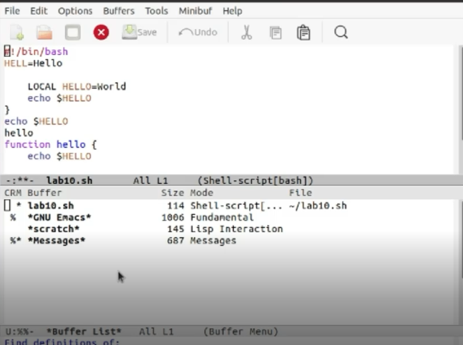

---
## Front matter
lang: ru-RU
title: Отчет по лабораторной работе №10
author: |
	Безрук Мария Андреевна
institute: |
	RUDN University, Moscow, Russian Federation
	

## Formatting
toc: false
slide_level: 2
theme: metropolis
header-includes: 
 - \metroset{progressbar=frametitle,sectionpage=progressbar,numbering=fraction}
 - '\makeatletter'
 - '\beamer@ignorenonframefalse'
 - '\makeatother'
aspectratio: 43
section-titles: true
---

##Цель работы

Познакомиться с операционной системой Linux. Получить практические навыки работы с редактором Emacs.

## Задание

1.Ознакомиться с теоретическим материалом.

2.Ознакомиться с редактором emacs.

3.Выполнить упражнения.

4.Ответить на контрольные вопросы.

## Выполнение лабораторной работы

1) Откроем редактор Emacs с помощью команды «emacs&».

{ #fig:001 width=50% }

{ #fig:002 width=50% }

## Выполнение лабораторной работы

2) Создадим файл lab10.sh с помощью комбинации «Ctrl-x»«Ctrl-f».

{ #fig:003 width=70% }

## Выполнение лабораторной работы

3) В открывшемся буфере наберем необходимый текст

{ #fig:004 width=50% }

## Выполнение лабораторной работы

4) Сохраним файл с помощью комбинации «Ctrl-x»«Ctrl-s».

5.1) Вырежем одной командой целую строку («Сtrl-k»)

{ #fig:005 width=50% }

## Выполнение лабораторной работы

5.2) Вставим эту строку в конец файла («Ctrl-y») 

{ #fig:006 width=50% }

## Выполнение лабораторной работы

5.3) Выделим область текста («Ctrl-space») 

{ #fig:007 width=50% }

## Выполнение лабораторной работы

5.4) Скопируем область в буфер обмена («Alt-w»).

5.5) Вставим область в конец файла(«Ctrl-y») 

{ #fig:008 width=50% }

## Выполнение лабораторной работы

5.6) Вновь выделим эту область(«Ctrl-space»)

{ #fig:009 width=50% }

и на этот раз вырежем её («Ctrl-w»)

{ #fig:010 width=50% }

## Выполнение лабораторной работы

5.7) Отменим последнее действие («Ctrl-/»)

{ #fig:011 width=50% }

## Выполнение лабораторной работы

6.1) Переместим курсор в начало строки («Ctrl-a») 

{ #fig:012 width=50% }

## Выполнение лабораторной работы

6.2) Переместим курсор в конец строки («Ctrl-e») 

{ #fig:013 width=50% }

## Выполнение лабораторной работы

6.3) Переместим курсор в начало буфера («Alt-<»)

{ #fig:014 width=50% }

## Выполнение лабораторной работы

6.4) Переместим курсор в конец буфера («Alt->») 

{ #fig:015 width=50% }

## Выполнение лабораторной работы

7.1) Выведем список  активных  буферов  на  экран  («Ctrl-x»«Ctrl-b») 

{ #fig:016 width=70% }

## Выполнение лабораторной работы

7.2) Переместимся во  вновь  открытое  окно  («Ctrl-xo») со  списком открытых буферов и переключимся на другой буфер (для этого необходимо нажать на «enter» после выбора необходимого буфера) 

{ #fig:017 width=70% }

## Выполнение лабораторной работы

7.3) Закроем это окно («Ctrl-x0») 

{ #fig:018 width=40% }

7.4) Теперь вновь переключимся между буферами, но уже без вывода их списка на экран («Ctrl-x b») 

## Выполнение лабораторной работы

8.1) Поделим фрейм  на  4  части:  разделим  фрейм  на  два  окна  по вертикали («Ctrl-x 3»), а затем каждое из этих окон на две части по горизонтали («Ctrl-x 2»)

{ #fig:020 width=70% }

## Выполнение лабораторной работы

8.2) В каждом из четырёх созданных окон откроем новый буфер (файл) и введемнесколько строк текста. Для этого предварительно создадим эти файлы с помощью команд «touchexample1.txt»,«touchexample2.txt», «touchexample3.txt», «touchexample4.txt»

{ #fig:021 width=30% }

{ #fig:022 width=30% }

## Выполнение лабораторной работы

9.1) Переключимсяв режим поиска («Ctrl-s») и найдем несколько слов, присутствующих в тексте 

{ #fig:023 width=30% }

{ #fig:024 width=30% }

## Выполнение лабораторной работы

9.2) Переключимся между  результатами  поиска,  нажимая «Ctrl-s»

{ #fig:025 width=30% }

{ #fig:026 width=30% }

## Выполнение лабораторной работы

9.3) Выйдемиз режима поиска, нажав «Ctrl-g»

{ #fig:027 width=70% }

## Выполнение лабораторной работы

9.4) Перейдем в  режим  поиска  и  замены  («Alt-%»),  введем текст, который следует найти и заменить, нажмем «enter», затем введем текст для  замены.  После  того  как  будут  подсвечены  результаты  поиска, нажмем «!» для подтверждения замены. Важно, чтобы курсор находился в начале текста.

{ #fig:028 width=40% }

## Выполнение лабораторной работы

{ #fig:029 width=50% }

## Выполнение лабораторной работы

9.5) Пробуем другой режим поиска, нажав «Alt-so»
Данный вид поиска отличается от обычного тем, что тут считывается строка поиска,  которая трактуется как  регулярное  выражение, и не осуществляется поиск точного совпадения в тексте буфера.Регулярное выражение − это образец, который обозначает набор строк, возможно, и неограниченный набор.

{ #fig:030 width=30% }

# Вывод

В ходе выполнения данной лабораторной работы я познакомилась с операционной системой Linux и получила практические навыки работы с редактором Emacs
