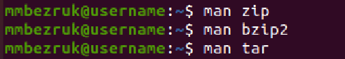
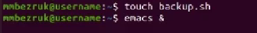
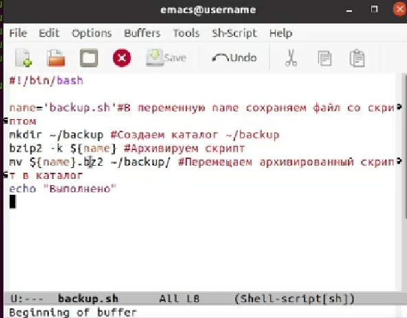
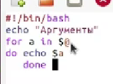
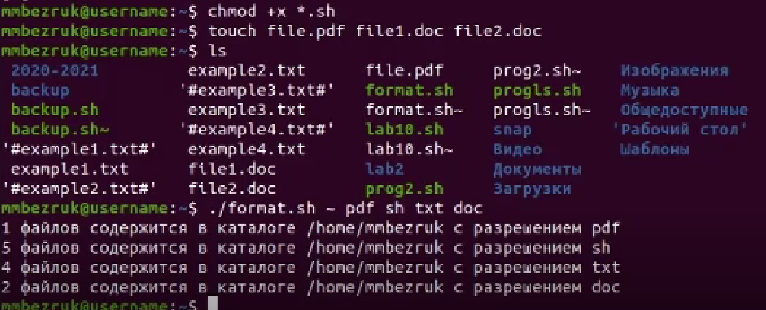

---
## Front matter
lang: ru-RU
title: Отчет по лабораторной работе №11
author: Безрук Мария Андреевна

	

## Formatting
toc: false
slide_level: 2
theme: metropolis
header-includes: 
 - \metroset{progressbar=frametitle,sectionpage=progressbar,numbering=fraction}
 - '\makeatletter'
 - '\beamer@ignorenonframefalse'
 - '\makeatother'
aspectratio: 43
section-titles: true
---

## Цель работы

Изучить основы программирования в оболочке ОС UNIX/Linux. Научиться пи-сать небольшие командные файлы.

## Задание

1.Ознакомиться с теоретическим материалом.

2.Изучить основы программирования в оболочке ОС UNIX/Linux.

3.Выполнить упражнения.

4.Ответить на контрольные вопросы.

## Выполнение лабораторной работы

1) Для начала я изучила команды архивации, используя команды «man zip», «man bzip2», «man tar» 

{ #fig:001 width=40% }

## Выполнение лабораторной работы

2) Далее я создала файл, в котором буду писать первый скрипт, и открыла его в редакторе emacs, используя клавиши «Ctrl-x»и «Ctrl-f»(команды «touchbackup.sh» и «emacs&»)

{ #fig:002 width=30% }

## Выполнение лабораторной работы

3) После написала скрипт, который при запуске будет делать резервную копию самого себя (то есть файла, в котором содержится его исходный код)  в другую  директорию backup в  вашем  домашнем  каталоге.  При этом файл должен архивироваться одним из архиваторов на выбор zip, bzip2  или tar. При  написании  скрипта  использовала архиватор bzip2.

{ #fig:003 width=40% }

## Выполнение лабораторной работы

4) Проверила  работу  скрипта (команда «./backup.sh»),  предварительно добавив  для  него  право  на  выполнение  (команда «chmod+x*.sh»). Проверила, появился ли каталог backup/, перейдя в него (команда «cdbackup/»),  посмотрела  его  содержимое  (команда «ls») и  просмотрела содержимое архива (команда «bunzip2 -cbackup.sh.bz2»).Скрипт работает корректно.

5) Создала файл, в котором буду писать второй скрипт, и открыла его в редакторе emacs, используя клавиши «Ctrl-x» и «Ctrl-f» (команды «touchprog2.sh» и «emacs&»)

## Выполнение лабораторной работы

6) Написала пример командного  файла, обрабатывающего любое произвольное число аргументов командной строки, в том числе превышающее десять. Например, скрипт  может  последовательно распечатывать значения всех переданных аргументов.

{ #fig:004 width=40% }

## Выполнение лабораторной работы

7) Проверила работу написанного скрипта (команды «./prog2.sh0 1 2 3 4» и «./prog2.sh0 1 2 3 45 6 7 8 9 10 11»), предварительно добавив для него право на выполнение (команда «chmod+x*.sh»).Вводила аргументы, количество которых меньше 10 и больше 10.Скрипт работает корректно.

8) Создала файл, в котором буду писать третий скрипт, и открыла его в редакторе emacs, используя клавиши «Ctrl-x» и «Ctrl-f» (команды «touchprogls.sh» и «emacs&»)

## Выполнение лабораторной работы

9) Написала командный  файл −аналог  команды ls (без  использования самой этой команды и команды dir). Он должен выдавать информацию о нужном каталоге и выводить информацию о возможностях доступа к файлам этого каталога

10) Далее проверила работу скрипта (команда «./progls.sh~»), предварительно  добавив  для  него  право  на  выполнение  (команда «chmod+x*.sh»).Скрипт работает корректно.

## Выполнение лабораторной работы

11) Для четвертого скрипта также создала файл (команда «touchformat.sh»)и открыла его в редакторе emacs, используя клавиши «Ctrl-x» и «Ctrl-f» (команда «emacs&») 

{ #fig:005 width=40% }

## Выполнение лабораторной работы

12) Написала командный  файл,  который  получает  в  качестве  аргумента командной строки формат файла (.txt, .doc, .jpg, .pdfи т.д.) и вычисляет количество таких файлов в указанной директории. Путь к директории также передаётся в виде аргумента командной строки

## Выполнение лабораторной работы

13) Проверила работу написанного скрипта (команда «./format.sh~ pdfshtxtdoc»), предварительно добавив для него право на выполнение (команда «chmod+x*.sh»), а также создав дополнительные файлы с разными расширениями (команда «touchfile.pdf file1.doc file2.doc»).Скрипт работает корректно.

{ #fig:006 width=30% }

## Выводы

В ходе выполнения данной лабораторной работы я изучила основы программирования в оболочке ОС UNIX/Linux и научилась писать небольшие командные файлы.
