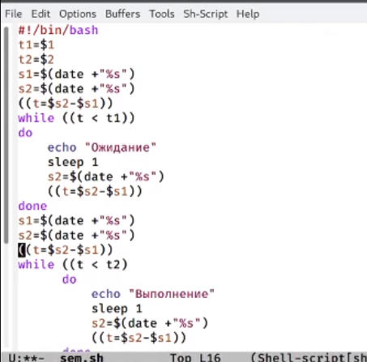
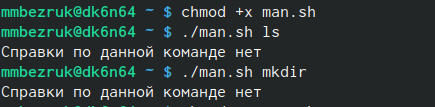

---
## Front matter
lang: ru-RU
title: Laboratory №13
author: |
	Bezruk M.A.
institute: |
	RUDN University, Moscow, Russian Federation
	
date: MAY--2021

## Formatting
toc: false
slide_level: 2
theme: metropolis
header-includes: 
 - \metroset{progressbar=frametitle,sectionpage=progressbar,numbering=fraction}
 - '\makeatletter'
 - '\beamer@ignorenonframefalse'
 - '\makeatother'
aspectratio: 43
section-titles: true
---

## Цель работы

Изучить основы программирования в оболочке ОС UNIX. Научится писать более сложные командные файлы с использованием логических управляющих конструкций и циклов.

## Задание

1. Написать командный файл, реализующий упрощённый механизм семафоров.

2. Реализовать команду man с помощью командного файла.

3. Используя встроенную переменную "$RANDOM", напишите командный файл, генерирующий случайную последовательность букв латинского алфавита.

## Ход работы:

1. Написала командный  файл,  реализующий  упрощённый  механизм семафоров. Командный файл должен в течение некоторого времени t1 дожидаться освобождения ресурса, выдавая об этом сообщение, а дождавшись  его  освобождения,  использовать  его  в  течение некоторого времени t2<>t1, также выдавая информацию о том, что ресурс   используется   соответствующим   командным   файлом (процессом). Для данной задачи я создала файл: sem.sh и написала соответствующий скрипт.

{ #fig:001 width=25% } 

Далее я проверила работу написанного скрипта (./sem.sh 4 7), добавив право на исполнение файла (chmod +x .sh). Скрипт работает корректно. Скрипт работает корректно.

После этого я изменила скрипт так,чтобы его можно было выполнять в нескольких  терминалах и  проверила  его  работу (например,  команда «./sem.sh2 3 Ожидание > /dev/pts/1 &»)

## Ход работы:

2. Реализовала команду man с помощью командного файла. Изучиласодержимое  каталога  /usr/share/man/man1. В  нем находятся  архивы  текстовых  файлов,  содержащих  справку  по большинству установленных в
системе программ и команд.

 Каждый архив  можно  открыть  командой less сразу  же  просмотрев содержимое  справки.  Командный  файл  должен  получать  в  виде аргумента командной строки название команды и в виде результата выдавать  справку  об  этой  команде  или  сообщение  об  отсутствии справки, если соответствующего файла нет в каталоге man1.
 

## Ход работы:

Для данной звдвчи я создала файл : man.sh  и написала соответствующий скрипт.

{ #fig:007 width=40% } 

## Ход работы:
Далее я проверила работу написанного скрипта (команды «./man.sh ls»,
«./man.sh mkdir»), предварительно добавив право на исполнение файла (команда «chmod +x man.sh»). Cкрипт сработал и вывел, что по данным командам справок нет. Скрипт работает корректно.

{ #fig:008 width=40% } 

## Ход работы:

3. Используя встроенную переменную $RANDOM, написала командный файл, генерирующий случайную последовательность букв латинского алфавита.
Для данной задачи я создала файл: random.sh и написала соответствующий скрипт.

Далее я проверила работу написанного скрипта (команды «./random.sh 7» и «./random.sh 15»), предварительно добавив право на исполнение файла (команда «chmod +x random.sh») 
Скрипт работает корректно.

## Вывод

В ходе выполнения данной лабораторной работы я изучила основы программирования в оболочке ОС UNIX, а также научилась писать более сложные командные файлы с использованием логических управляющих конструкций и циклов.

