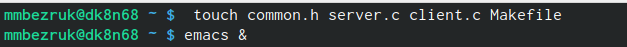
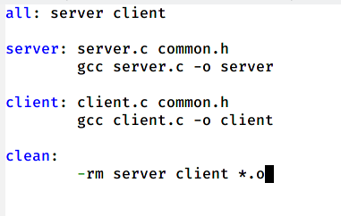
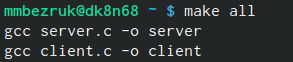
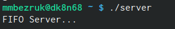

---
## Front matter
lang: ru-RU
title: Laboratory №15
author: |
	Bezruk M.A.
institute: |
	RUDN University, Moscow, Russian Federation
	
date: JUNE--2021

## Formatting
toc: false
slide_level: 2
theme: metropolis
header-includes: 
 - \metroset{progressbar=frametitle,sectionpage=progressbar,numbering=fraction}
 - '\makeatletter'
 - '\beamer@ignorenonframefalse'
 - '\makeatother'
aspectratio: 43
section-titles: true
---

## Цель работы

Приобретение практических навыков работы с именованными каналами.

## Задание 

1. Ознакомиться с теоретическим материалом.

2. Изучить основы программирования в оболочке ОС UNIX/Linux.

3. Выполнить упражнения.

4. Ответить на контрольные вопросы.

## Выполнение лабораторной работы

1. Для начала я создала необходимые файлы с помощью команды «touch common.h server.c client.c Makefile» и открыла редактор emacs для их редактирования.

{ #fig:001 width=60% } 

2. Далее я изменила коды программ, представленных в тексте лабораторной работы.

## Выполнение лабораторной работы

3. В файл common.h добавила стандартные заголовочные файлы unistd.h и time.h, необходимые для работы кодов других файлов. Common.h предназначен для заголовочных файлов, чтобы в остальных программах их не прописывать каждый раз.

4. В файл server.c добавила цикл while для контроля за временем работы сервера. 

 5. В файл client.c добавила цикл, который отвечает за количество сообщений о текущем времени, которое получается в результате выполнения команд и команду sleep(5) для приостановки работы клиента на 5 секунд.

## Выполнение лабораторной работы

6. Makefile (файл для сборки) не изменяла.

{ #fig:006 width=40% }

7. После написания кодов я, используя команду «make all», скомпилировала необходимые файлы.

{ #fig:007 width=40% }

## Выполнение лабораторной работы

8. Далее я проверила работу написанного кода. Отрыла 3 консоли (терминала) и запустила: в первом терминале − «./server», в остальных двух – «./client».

В результате каждый терминал - клиент вывел по 4 сообщения. Спустя 30 секунд работа сервера была прекращена. Программа работает корректно.

## Выполнение лабораторной работы

9. Также я отдельно проверила длительность работы сервера, введя команду «./server» в одном терминале. Он завершил свою работу через 30 секунд.Если сервер завершит свою работу, не закрыв канал, то, когда мы будем запускать этот сервер снова, появится ошибка «Невозможно создать FIFO», так как у нас уже есть один канал.

{ #fig:010 width=70% }

## Вывод 

В ходе выполнения данной лабораторной работы я приобрела практические навыки работы с именованными каналами.

